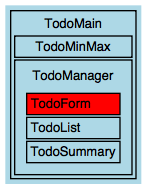

# Connecting With External JavaScript

_Note: this is Part 5 of "Composing Features and Behaviours in the Elm Architecture". See the
[Introduction](https://github.com/foxdonut/adventures-reactive-web-dev/tree/master/client-elm#composing-features-and-behaviours-in-the-elm-architecture)
for an overview and the table of contents._

Questions as Github issues, and corrections or suggestions for improvement as Github pull requests, are welcome.

In
[Part 4](https://github.com/foxdonut/adventures-reactive-web-dev/tree/elm-040-todominmax-feature/client-elm#composing-features),
we grouped three features together into one. We connected that to another feature with signals and
addresses, and combined their views into the main view.

Now, let's consider the situation where we have external JavaScript code that we would like to
connect to our Elm application. We want two-way communication: that is, we want to send data from
the external JavaScript code into our Elm application, and from our Elm application back out to the
external JavaScript.

## Externalizing the TodoForm

For the purposes of this example, let's consider that the `TodoForm` is an external JavaScript
component. The rest of the application remains in Elm:



Remember that the `TodoForm` listens to the `TodoList`'s _edit_ so that the form gets populated when
the users clicks on an _Edit_ button. That will need to be a signal from Elm to external JavaScript.
Going the other way, the `TodoForm` notifies listeners when a todo is _saved_. Once we connect the
signal from external JavaScript into Elm, we'll need to hook it up to the `TodoList` and the
`TodoSummary` so that they can update themselves.


Whereas before, the view for `TodoManager` was the combination of the `TodoList`, `TodoForm`, and
`TodoSummary` views:

[TodoManager/View.elm](TodoManager/View.elm)
```elm
view todoListView todoFormView todoSummaryView =
  div
    []
    [ todoFormView
    , todoListView
    , todoSummaryView
    ]
```

Now, we'll just put a placeholder `div` with an id for the `TodoForm`:

[TodoManager/View.elm](TodoManager/View.elm)
```elm
view todoListView todoSummaryView =
  div
    []
    [ div [ id "todoForm"] [] --<<----
    , todoListView
    , todoSummaryView
    ]
```

[app.js](app.js)
```javascript
var Elm = require("./Main.elm");
var elmApp = Elm.embed(Elm.Main, document.getElementById("app"));

var container = document.getElementById("todoForm");
container.innerHTML = "<div class='row'>" +
  // ...
  "<form>" +
  // ...
  "<input class='form-control' name='priority' id='priority'>" +
  // ...
  "<input class='form-control' name='description' id='description'>" +
  // ...
  "<button class='btn btn-primary btn-xs' id='save'>Save</button> " +
  "<button class='btn btn-danger btn-xs' id='cancel'>Cancel</button>" +
  // ...
```

That sure is an ugly way of constructing an HTML view! I am _not_ advocating this code as good
practice. There are other ways that are definitely better, but that is not the point of this
article. For the purposes of this example, we just want the form to be in JavaScript so that we can
see how we connect it to Elm.

[app.js](app.js)
```javascript
var $ = require("jquery");

var editTodo = function(todo) {
  $("#todoId").val(todo.id);
  $("#priority").val(todo.priority);
  $("#description").val(todo.description);
};

elmApp.ports.editTodo.subscribe(editTodo);
```

[Main.elm](Main.elm)
```elm
port editTodo : Signal Todo
port editTodo =
  todoMainFeature.editTodoSignal
```

[app.js](app.js)
```javascript
var elmApp = Elm.embed(Elm.Main, document.getElementById("app"), {saveTodo: null});
```

[app.js](app.js)
```javascript
var cancel = function(evt) {
  evt.preventDefault();
  $("#todoId").val("");
  $("#priority").val("");
  $("#description").val("");
};

$("#save").on("click", function(evt) {
  evt.preventDefault();
  var todo = {
    id: parseInt($("#todoId").val() || 0),
    priority: parseInt($("#priority").val() || 1),
    description: $("#description").val()
  };
  $.post("/api/saveTodo", JSON.stringify(todo), function(response) {
    elmApp.ports.saveTodo.send(response);
    cancel(evt);
  }, "json");
});

$("#cancel").on("click", cancel);
```

[Main.elm](Main.elm)
```elm
port saveTodo : Signal (Maybe Todo)

todoMainFeature = createTodoMainFeature saveTodo
```

If you enjoy this article, consider [tweeting](https://twitter.com/intent/tweet?original_referer=http%3A%2F%2Fgithub.com%2Ffoxdonut%2Fadventures-reactive-web-dev%2Ftree%2Fmaster%2Fclient-elm&text=Composing%20Features%20and%20Behaviours%20in%20the%20Elm%20Architecture&tw_p=tweetbutton&url=http%3A%2F%2Fgithub.com%2Ffoxdonut%2Fadventures-reactive-web-dev%2Ftree%2Fmaster%2Fclient-elm&via=foxdonut00) it to your followers.
